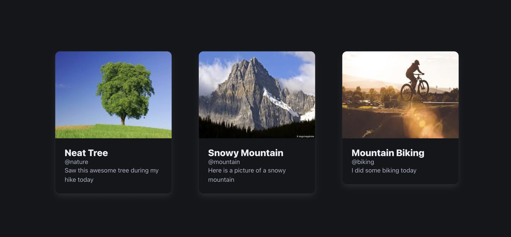

# Cards

A clean, modern Angular 20 application that displays a collection of card posts, each with an image, username, title, and content. The app highlights modular architecture using a reusable `card` component styled with Bulma CSS.

---

## Screenshot



---

## Features

- **Reusable Card Component:** Display posts as card elements with title, username, image, and descriptive content.
- **Modular Architecture:** Easy separation of concerns with `app` (parent) and `card` (child) components.
- **Responsive Styling:** Uses Bulma CSS for elegant, responsive design.
- **Simple Data Binding:** List of posts rendered with Angular's modern syntax and signals.

---

## Getting Started

### Prerequisites

- **Node.js** (LTS version recommended)
- **npm** (comes with Node.js)
- **Angular CLI** (`@angular/cli` v20+)

### Installation

```bash
  git clone https://github.com/aryanbhardwaj24/mini-projects
```

```bash
  cd mini-projects/cards
```

```js
  npm install
```

### Running the App

Start the local development server:

```js
npm start
```

Visit [http://localhost:4200](http://localhost:4200) in your browser.

---

## Usage

1. On loading, you'll see a set of visually appealing cards, each showing:
   - **Image**
   - **Title**
   - **Username**
   - **Content**
2. Add new posts to the `posts` array in `app.ts` to display more cards.
3. Customize card visuals using `card.css` or global styles in `app.css`.

---

## Scripts

| Command     | Description              |
| ----------- | ------------------------ |
| `npm start` | Run local dev server     |
| `npm build` | Build app for production |
| `npm test`  | Run unit tests           |

---

## Dependencies

- **Angular v20+**
- **Bulma v1+**
- **RxJS**
- See `package.json` for details.

---

## How to Add a Post

In `app.ts`, add a new object to the `posts` array, e.g.:

```js
{
title: 'Sunset Beach',
username: 'beachlover',
imageURL: 'images/beach.jpeg',
content: 'Enjoyed a beautiful sunset at the beach!',
}
```

---

## Customization

- Update styles in `app.css` and `card.css` for global or card-specific look.
- Extend `card.ts` and `card.html` for more features, such as user avatars or links.
- Replace Bulma classes in the HTML files as desired.

---

## Contributing

Feel free to submit issues or pull requests! For major changes, please open an issue first to discuss what you'd like to modify.

---

## Acknowledgments

- **Angular** for the robust SPA foundation.
- **Bulma** for easy-to-use responsive styling.

---

## 👤 Author

**Aryan Bhardwaj**

- [LinkedIn](https://www.linkedin.com/in/aryanbhardwaj24/)
- [Github](https://github.com/aryanbhardwaj24/)
