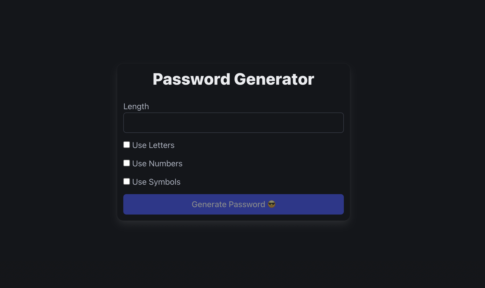
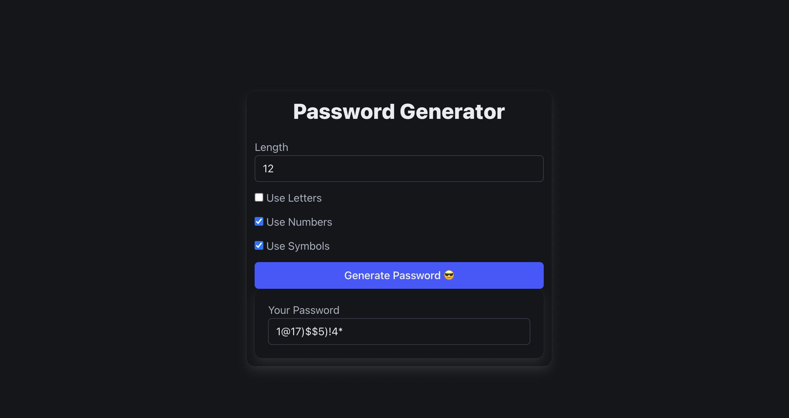

# Password Generator - Angular App

A professional, simple Angular app for generating secure, custom passwords. Easily choose password length and select which character sets (letters, numbers, symbols) you'd like included. Perfect for quickly getting random passwords for any site or service.

---

## Screenshot




---

## Features

- **Adjustable length:** Set password length with a simple input.
- **Character set selection:** Toggle inclusion of letters, numbers, and symbols.
- **Instant generation:** Create strong, random passwords with a click.
- **Bulma CSS:** Clean, responsive design using Bulma.

---

## Getting Started

### Prerequisites

- **Node.js** (LTS recommended)
- **npm** (comes with Node.js)
- **Angular CLI** (`@angular/cli` v20+)

### Installation

```bash
  git clone https://github.com/aryanbhardwaj24/mini-projects
```

```bash
  cd mini-projects/password-generator
```

```js
  npm install
```

### Running the App

Start the local development server:

```js
npm start
```

Visit [http://localhost:4200](http://localhost:4200) in your browser.

---

## Usage

1. **Choose length:** Enter desired password length.
2. **Select character types:** Use the checkboxes to include Letters, Numbers, and/or Symbols.
3. **Generate:** Click "Generate Password 😎" to create your new password.
4. **Copy:** Copy your password from the displayed input.

---

## Customization

- To change design, modify `styles.css` or adjust Bulma classes in `app.html`.
- For password rules or character sets, edit the variables in `onButtonClick()` inside `app.ts`.

---

## Scripts

| Command     | Description                         |
| ----------- | ----------------------------------- |
| `npm start` | Launch dev server at localhost:4200 |
| `npm build` | Build app for production            |
| `npm test`  | Run unit tests                      |

---

## Dependencies

- **Angular v20+**: Framework
- **Bulma v1+**: CSS Framework
- **RxJS**: Reactive programming

See `package.json` for complete listings.

---

## License

This project is **private** by default. Make sure to add your preferred license before releasing publicly.

---

## Contributing

Feel free to submit issues or pull requests! For major changes, please open an issue first to discuss what you'd like to modify.

---

## Acknowledgments

- **Angular** for the robust SPA foundation.
- **Bulma** for easy-to-use responsive styling.

---

## 👤 Author

**Aryan Bhardwaj**

- [LinkedIn](https://www.linkedin.com/in/aryanbhardwaj24/)
- [Github](https://github.com/aryanbhardwaj24/)
