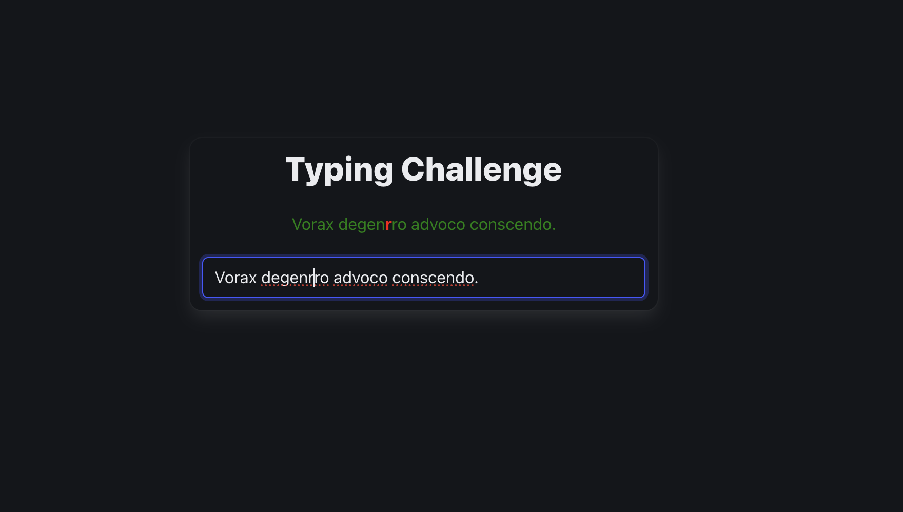
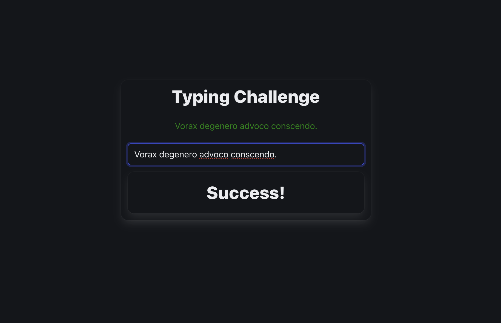

# Typing

A simple Angular 20 application simulating a typing speed test. The app generates a random sentence and compares each character you type against the target sentence, providing instant feedback as you type.

---

## Screenshot




---

## Features

- **Random Sentence Generation:** Uses Faker.js to generate a new sentence every time the app loads.
- **Character-by-Character Comparison:** User input is instantly compared with the target sentence character-by-character.
- **Typing Practice Simulation:** Visual feedback for each typed character helps users identify mistakes and improve accuracy.
- **Responsive Design:** Styled with Bulma CSS for a clean, modern interface.

---

## Getting Started

### Prerequisites

- **Node.js** (LTS recommended)
- **npm**
- **Angular CLI** (`@angular/cli` v20+)

### Installation

```bash
  git clone https://github.com/aryanbhardwaj24/mini-projects
```

```bash
  cd mini-projects/typing
```

```js
  npm install
```

### Running the App

Start the local development server:

```js
npm start
```

Visit [http://localhost:4200](http://localhost:4200) in your browser.

---

## Usage

1. **View Random Sentence:** The app displays a randomly generated sentence at the top.
2. **Start Typing:** Type the sentence into the input box below.
3. **See Feedback:** As you type, each character is compared against the target sentence. Correctly typed characters are distinguished from mistakes in real-time.
4. **Completion:** Continue typing until the entire sentence matches.

---

## Scripts

| Command     | Description              |
| ----------- | ------------------------ |
| `npm start` | Run local dev server     |
| `npm build` | Build app for production |
| `npm test`  | Run unit tests           |

---

## Dependencies

- **Angular v20+**
- **@faker-js/faker:** For generating random sentences.
- **Bulma v1+**
- **RxJS**

See `package.json` for the full list.

---

## Customization

- Modify styles in `app.css` for custom feedback (e.g., color-coding correct/incorrect characters).
- Change random sentence parameters in `faker.lorem.sentence()` for different lengths or types of sentences.
- Add scoring, timing, or other features to enhance the typing test.

---

## Contributing

Feel free to submit issues or pull requests! For major changes, please open an issue first to discuss what you'd like to modify.

---

## Acknowledgments

- **Angular:** Trusted SPA framework.
- **Faker.js:** Easy random sentence generator.
- **Bulma:** Clean, responsive CSS utility.

---

## 👤 Author

**Aryan Bhardwaj**

- [LinkedIn](https://www.linkedin.com/in/aryanbhardwaj24/)
- [Github](https://github.com/aryanbhardwaj24/)
